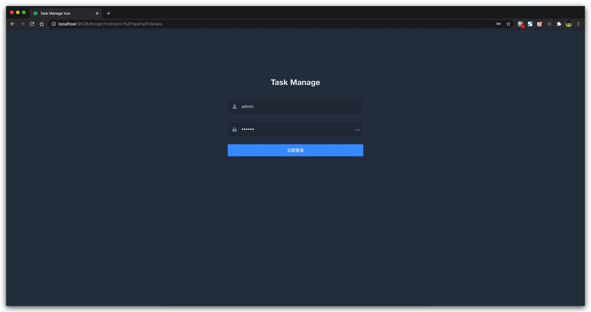
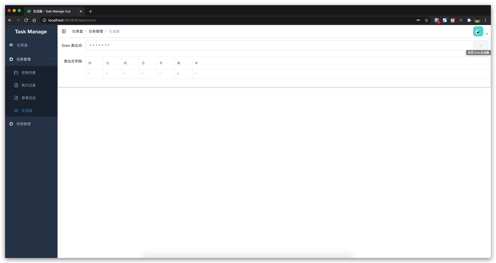

# task-manage-vue

> A vue admin template with Element UI for task-manage

[https://github.com/dianjiu/task-manage-vue](https://github.com/dianjiu/task-manage-vue)

[https://gitee.io/dianjiu/task-manage-vue](https://gitee.io/dianjiu/task-manage-vue)

## 相关项目 task-manage 

> 基于SpringBoot的轻量级定时任务管理系统

[https://github.com/dianjiu/task-manage](https://github.com/dianjiu/task-manage)

[https://gitee.io/dianjiu/task-manage](https://gitee.io/dianjiu/task-manage)

## 在线演示

http://task.point9.top/damin   (部署中。。。)

测试账号  	测试密码

admin 		admin

user 		user

## 项目图片

### 页面演示
> 登录页



> 仪表盘


> 任务管理 =》任务列表


> 任务管理 =》生成器 （关闭cron生成器）



> 任务管理 =》生成器 （打开cron生成器）


## Build Setup

```bash
# 克隆项目
git clone https://github.com/dianjiu/task-manage-vue.git

# 进入项目目录
cd task-manage-vue

# 安装依赖
yarn install

# 启动服务
yarn run dev
```

浏览器访问 [http://localhost:9528](http://localhost:9528)

## 发布

```bash
# 构建测试环境
yarn run build:stage

# 构建生产环境
yarn run build:prod
```

## 其它

```bash
# 预览发布环境效果
yarn run preview

# 预览发布环境效果 + 静态资源分析
yarn run preview -- --report

# 代码格式检查
yarn run lint

# 代码格式检查并自动修复
yarn run lint -- --fix
```
